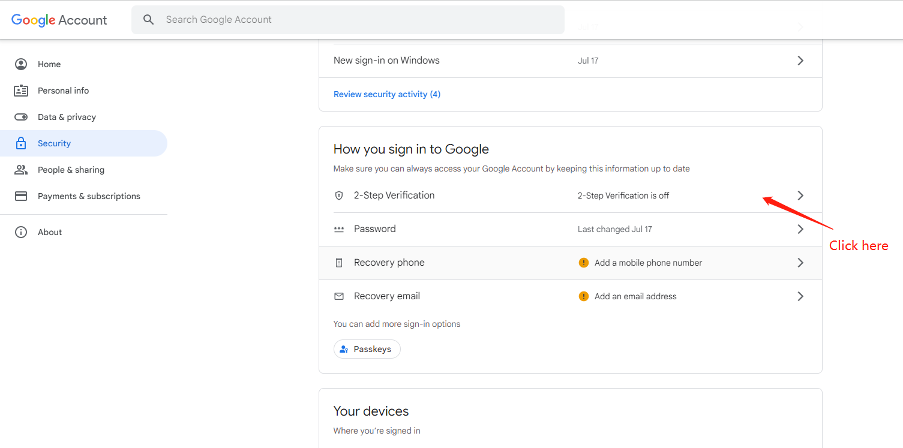
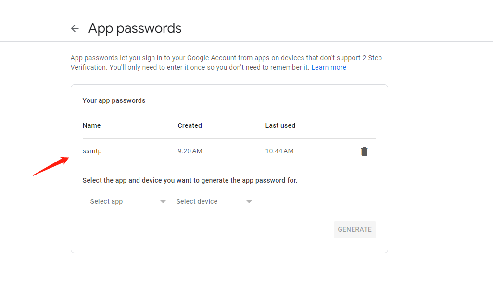

# Monitoring CPU Usage

Monitoring-using-bash
Monitor CPU percentage of an ec2 instance every minute and send top 5 process names to a email if CPU usage exceeds 70%

## Setting up the ubuntu environment. 

```
sudo apt update
sudo apt install sysstat
sudo apt install ssmtp
sudo apt install mailutils
```

## Setting up ssmtp

```
sudo vim /etc/ssmtp/ssmtp.conf 
```

Paste these below followings. 

```
mailhub=smtp.gmail.com:587
AuthUser=your_gmail@gmail.com
AuthPass=your_gmail_password_for_ssmtp
UseSTARTTLS=YES
```

**Note**: Please replace `your_gmail@gmail.com` to your email and `your_gmail_password_for_ssmtp` to your gmail password for ssmtp

You can set gmail password for ssmtp in google account settings




Then click `Get started` button



When you add ssmtp to here, you will get the password for ssmtp


Test it with below simple echo cmd 

```
echo “your text” | ssmtp your_receiver@gmail.com
```

## Create shell

Then , login with root and Create folder and file 

```
sudo su mkdir SCRIPTS 
touch CpuAlert 
chmod +x CpuAlert.sh 
vi CpuAlert.sh
```

Copy paste the CpuAlert.sh files from this repo and replace your desired destination mail ID and Percentage threshold.

**Note**: Please replace `receiver_email@ex.com` to the email you will receive email notifications In the 6 line of CpuAlert.sh

## Execute

```
sh -x CpuAlert.sh
```

Now , whenever the file is executed, it will check the CPU usage and if it exceeds more than 70, it will send the top 5 process to the destination mail through SMTP.

Now, we have to enable CRONTAB for sheduling to run the command for every 1 minute.

```
crontab -e
```

```
_/1 _ \* \* \* /bin/bash /home/user_name/SCRIPTS/CpuAlert.sh
```

